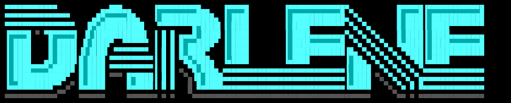

<div align="center">



# 🌙 Darlene Dotfiles

**A sleek, modern, and minimalist Hyprland desktop environment configuration for Linux.**


</div>

---

## 📋 Table of Contents

- [About the Project](#-about-the-project)
- [✨ Key Components](#-key-components)
- [📦 Repository Structure](#-repository-structure)
- [🛠️ System Requirements](#️-system-requirements)
- [🚀 Installation](#-installation)
- [⌨️ Keyboard Shortcuts](#️-keyboard-shortcuts)
- [🎨 Customization](#-customization)
- [📄 License](#-license)

---

## 🏔️ About the Project

**Darlene Dotfiles** is a comprehensive configuration suite for **Hyprland** desktop environments designed to deliver an aesthetic, responsive, and highly functional workflow. It includes a custom **Eww** widget system, modular **Lua**-based Hyprland configuration, dynamic **Pywal** color palette generation, and an advanced **Neovim** IDE setup.

---

## ✨ Key Components

| Component | Tool | Description |
| :--- | :--- | :--- |
| **Window Manager** | [Hyprland](https://hyprland.org) | Wayland compositor configured dynamically via `hyprland.lua`. |
| **Widgets & Bar** | [Eww](https://github.com/elkowar/eww) | Topbar, volume/brightness/microphone OSD, and interactive wallpaper selector. |
| **Launcher** | [Rofi](https://github.com/davatorium/rofi) | Application launcher and runner with custom styling. |
| **Terminal** | [Kitty](https://sw.kovidgoyal.net/kitty/) | GPU-accelerated terminal emulator integrated with Pywal themes. |
| **Text Editor** | [Neovim](https://neovim.io) | Full IDE setup with `lazy.nvim`, LSP, Telescope, Treesitter, and Neo-tree. |
| **Notifications** | [Mako](https://github.com/emersion/mako) | Lightweight notification daemon for Wayland. |
| **Theming & Colors** | Pywal / Wallpapers | Dynamic color palettes generated automatically from active wallpaper. |

---

## 📦 Repository Structure

```text
~/.config/
├── docs/                   # Visual assets and repository logo
│   └── darlene-logo.png
├── hypr/                   # Hyprland Compositor Configuration
│   ├── hyprland.lua        # Main configuration in Lua
│   └── hyprlock.conf       # Screen lock configuration
├── eww/                    # Widget System & GUI (Eww)
│   ├── eww.yuck / eww.scss # SCSS styling and layouts
│   ├── topbar/             # Top status bar widget
│   ├── osd/                # On-Screen Displays (Volume/Brightness/Mic)
│   ├── wallpapers/         # Interactive wallpaper selector widget
│   └── scripts/            # Helper Bash scripts for Eww
├── rofi/                   # Rofi Launcher Configuration
│   ├── config.rasi
│   └── theme.rasi
├── kitty/                  # Kitty Terminal Configuration
│   ├── kitty.conf
│   └── current-theme.conf
├── mako/                   # Notification Daemon Config
│   └── config
├── nvim/                   # Neovim Configuration (Lazy.nvim)
│   ├── init.lua
│   └── lua/plugins/        # Plugins (LSP, Telescope, Lualine, Treesitter, etc.)
├── wallpapers/             # Wallpaper gallery
├── install.sh              # Automated setup & verification script
└── LICENSE                 # MIT License
```

---

## 🛠️ System Requirements

Ensure the following packages are installed on your Linux distribution (Arch Linux / EndeavourOS / Fedora / Debian / etc.):

### Core Dependencies
```bash
# Arch Linux (pacman)
sudo pacman -S hyprland kitty eww rofi-wayland mako neovim jq wireplumber brightnessctl
```

### Optional & Recommended Tools
```bash
# Color generator & background utilities
pip install pywal
# Recommended utilities: awww / hyprpaper, hyprlock, gnome-keyring
```

---

## 🚀 Installation

### Automated Method (Recommended)

Clone this repository into your `~/.config` folder and run the setup script:

```bash
# 1. Clone the repository
git clone https://github.com/your-username/dotfiles.git ~/.config

# 2. Navigate and run the installation script
cd ~/.config
./install.sh
```

#### Installation Options

```bash
# Check dependencies without modifying files
./install.sh --check-deps

# Create a backup of your existing ~/.config entries
./install.sh --backup
```

---

## ⌨️ Keyboard Shortcuts

Below is a summary of keybindings defined in `hyprland.lua`:

| Shortcut | Action |
| :--- | :--- |
| <kbd>SUPER</kbd> + <kbd>Return</kbd> | Open Terminal (`kitty`) |
| <kbd>SUPER</kbd> + <kbd>Space</kbd> / <kbd>R</kbd> | Open Application Launcher (`rofi`) |
| <kbd>SUPER</kbd> + <kbd>E</kbd> | Open File Manager (`dolphin`) |
| <kbd>SUPER</kbd> + <kbd>Q</kbd> | Close Active Window |
| <kbd>SUPER</kbd> + <kbd>L</kbd> | Lock Screen (`hyprlock`) |
| <kbd>SUPER</kbd> + <kbd>1 - 9</kbd> | Switch to Workspace 1 - 9 |
| <kbd>SUPER</kbd> + <kbd>SHIFT</kbd> + <kbd>1 - 9</kbd> | Move Active Window to Workspace 1 - 9 |
| Media Keys | Adjust Volume / Brightness / Microphone with Eww OSD |

---

## 🎨 Customization

1. **Wallpapers & Pywal**: Add new wallpapers into [`wallpapers/`](file:///home/dc9/.config/wallpapers). Use the Eww wallpaper selector widget or run `wal -i ~/.config/wallpapers/your-wallpaper.png` to refresh terminal and widget colors.
2. **Neovim Configuration**: Customize plugins or options under [`nvim/lua/plugins/`](file:///home/dc9/.config/nvim/lua/plugins).
3. **Eww Bar & Widgets**: Tweak styles in [`eww/topbar/topbar.scss`](file:///home/dc9/.config/eww/topbar/topbar.scss) and widget structure in [`eww/eww.yuck`](file:///home/dc9/.config/eww/eww.yuck).

---

## 📄 License

This repository is licensed under the **MIT License**. See [LICENSE](file:///home/dc9/.config/LICENSE) for more details.
